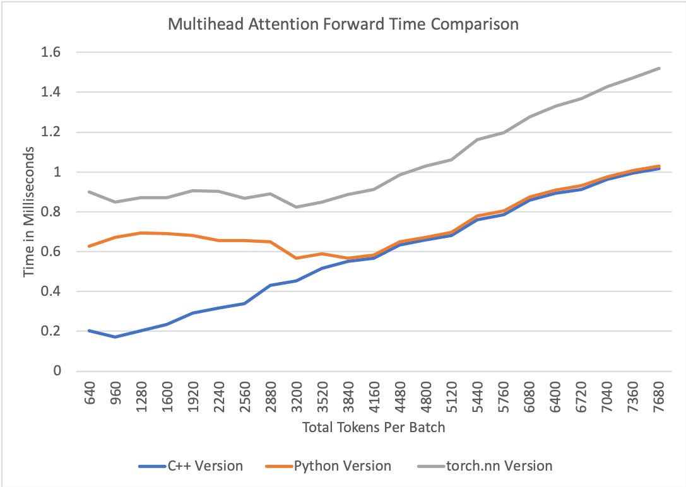
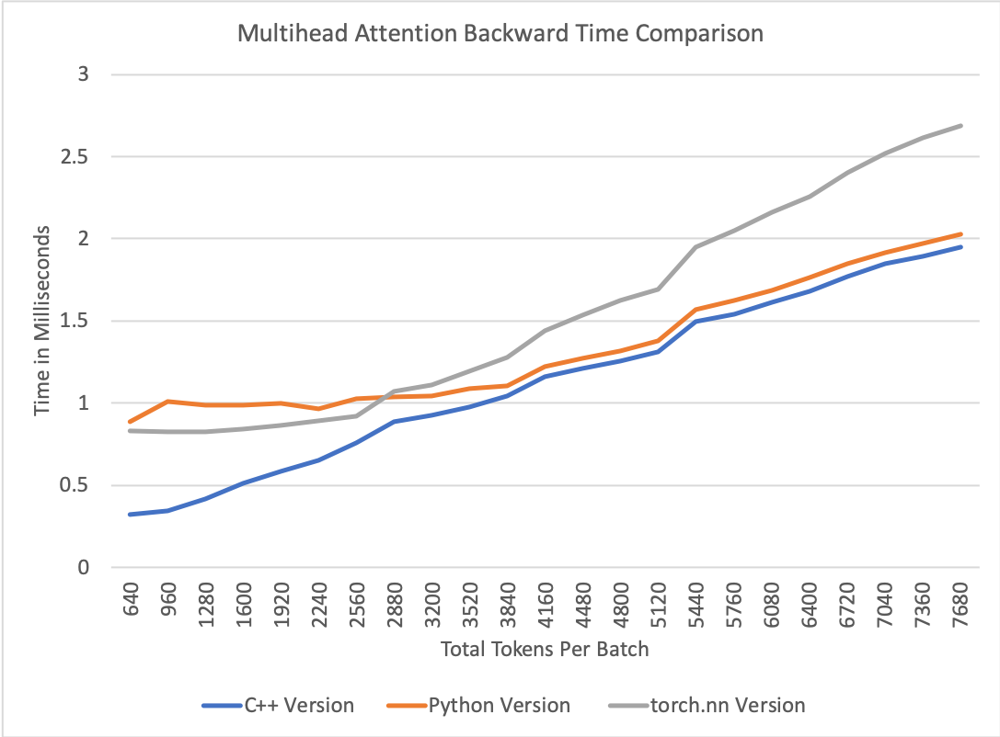

# Fast Multihead Attention 

This implementation has two main features :
* A C++ implementation to avoid the CPU overheads of Pytorch found with smaller batch sizes.
* The removal of all copies and transposes found in standard implementations of Multihead Attention.

|                                            | Python Version | C++ Version |
| :----------------------------------------- | :------------: | :---------: |
| Layer Norm and Residual Add Variant        | X              | X           |
| Includes Linear Biases                     | X              |             |
| Reduces CPU Overheads                      |                | X           |
| Fuses masking with Softmax                 |                | X           |
| Removes Transposes and Copies              | X              | X           |
| Includes Self and Encoder/Decoder Variants | X              | X           |

## How to Instantiate

`SelfMultiheadAttn(` _hidden dim_, _heads_, _dropout=prob_, _bias=bool_, _include_norm_add=bool_, _impl='fast'_ `)`
`EncdecMultiheadAttn(` _hidden dim_, _heads_, _dropout=prob_, _bias=bool_, _include_norm_add=bool_, _impl='fast'_ `)`

 `impl` has two options:
 * `fast` uses C++ Version
 * `default` uses Python Version

## Instructions to build on Linux

```
$ git clone https://github.com/NVIDIA/apex
$ cd apex
$ pip install -v --no-cache-dir --global-option="--cpp_ext" --global-option="--cuda_ext" --global-option="--fast_multihead_attn" ./
```
## Try Performance Tests Yourself!
Perf test script is found here!
```
cd contrib/examples/multihead_attn
```
#### Fast Multihead Attention
```
python perf_test_multihead_attn.py --ref
```
#### Fast Multihead Attention with C++ Implementation
```
python perf_test_multihead_attn.py
```
#### Compare with `torch.nn.MultiheadAttn`
```
python perf_test_multihead_attn.py --native
```
#### Test your own range!
```
python perf_test_multihead_attn.py --seq-length 64 --num-seqs-start 10 --num-seqs-stop 120 --num-seqs-inc 5
```

## Performance Comparisons

* Performance was measured with 64 token sequence lengths on an NVIDIA TitanV card.
* Time is measured across multiple layers to simulate an in model scenario.



